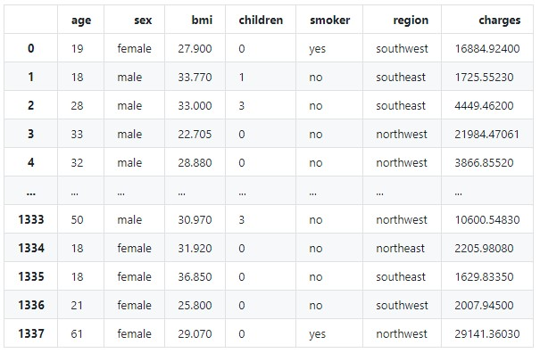
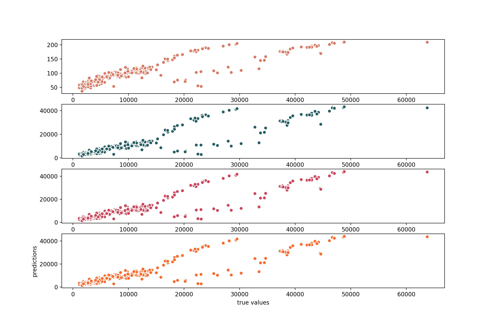
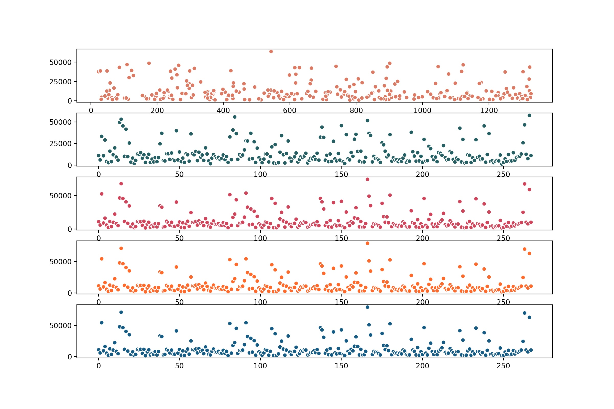

# medical cost predictions

In this notebook try to build a better predicting model to estimate medical cost
of person. in here use linear regression models using ordinary least square, gradient
decent, ridge regularization (L2), lasso regularization (L1), and polynomial methods.

# Dataset
dataset use in here is medical cost prediction dataset from **kaggle**. you can find it from <a href="https://www.kaggle.com/mirichoi0218/insurance">here</a>.

# models

# models performance when normal distribution
1. ***OLS*** - r2_score: 80.939860035233 MSE: 462.49007439686613
2. ***Gradient Descent*** - r2_score: 80.83391330922103 MSE: 465.06084823619557
3. ***Ridge Regression with gradient decent*** - r2_score: 80.9393006522291 MSE: 462.5036477015515
4. ***Lasso Regression with gradient decent*** - r2_score: 80.93931120043436 MSE: 462.50339175168745

# models performance when polynomial distribution
1. ***OLS*** - r2_score: 86.6583090316484
2. ***Gradient Descent*** - r2_score: 80.33592701210077
3. ***Ridge Regression with gradient decent*** - r2_score: 81.28809640222535
4. ***Lasso Regression with gradient decent*** - r2_score: 81.28792707426157

